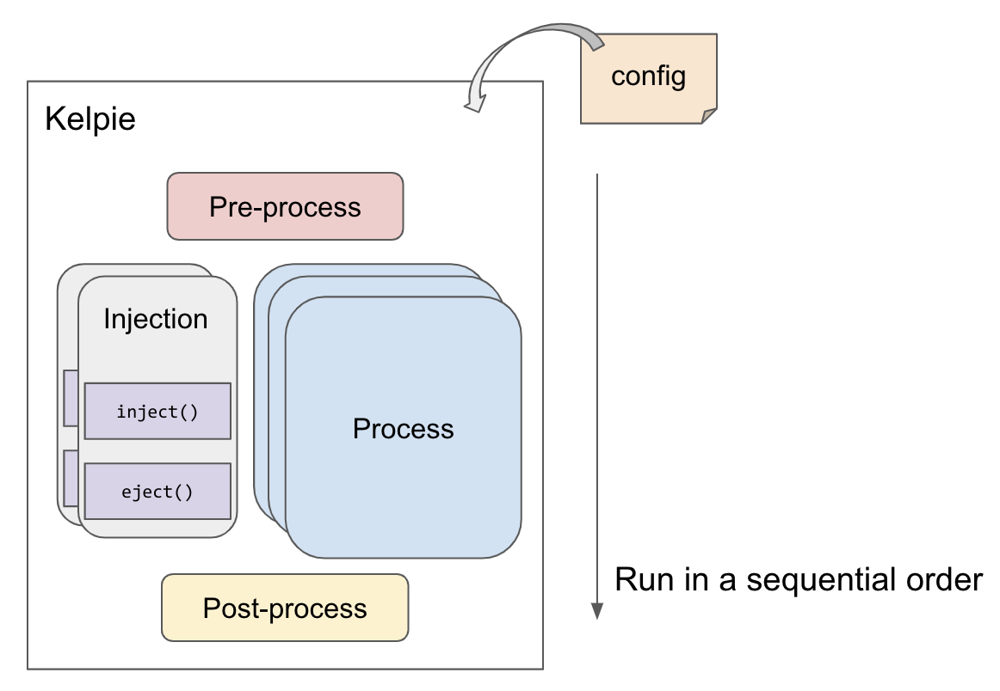

[](https://github.com/scalar-labs/kelpie/actions)

# Kelpie
## What is Kelpie ?
Kelpie is a simple yet general framework for running end-to-end testing such as system verification and benchmarking.

Kelpie executes a work called *job*. A job is composed of a set of *processes*, and a process is composed of a set of operations, and an operation is a minimum unit of work in Kelpie. At the current version, a job is composed of pre-defined processes such as pre-process, process and post-process. The job model is usually expressive enough to abstract various kind of testing such as benchmarking and verification.

Let's think about how a benchmark for a database can be abstracted with the Kelpie job model as an example. A benchmark usually has 3 steps; a data loading step where required initial data set is loaded, an actual benchmarking step where the performance is measured, and a reporting step where the benchmark results are summarized and reported. With Kelpie, a benchmark can be modeled as a job and each step can be modeled as pre-process, process and post-process respectively.

## How Kelpie works
Kelpie is composed of a framework that orchestrates a job and takes care of execution of processes, and a job that is executed by the framework.
As the following diagram shows, Kelpie executes a job by executing pre-process, process and post-process in a sequential order. A job can also have an injection process that is executed in parallel with the execution of process. Each process can be implemented with the corresponding modules called `PreProcessor`, `Processor`, `PostProcessor` and `Injector` respectively.

<p align="center">
  
  <br>
  Kelpie overview
</p>

# Usage
## Install
- Get the binary from [releases](https://github.com/scalar-labs/kelpie/releases)

## Build the source code if needed
```
./gradlew installDist
```
  - Of course, you can archive Kelpie jar and libraries by `distZip` and so on.

## Build your modules
1. The first thing to do to run your test with Kelpie, you need to create your own modules
    - Note that you don't need to create all 4 modules but you need at least one module. Please refer to [example modules](https://github.com/scalar-labs/kelpie-test//tree/master/print-modules/), which do trivial printing work.
    - Kelpie requires fat Jar file to load modules which depend on other libraries. The following gradle example uses Shadow plugin.
    - The APIs of Kelpie are available on Maven Central. You can install it in your application using your build tool such as Gradle.

      ```gradle
      plugins {
          id "com.github.johnrengelman.shadow" version "5.2.0"
      }

      dependencies {
          implementation group: 'com.scalar-labs', name: 'kelpie', version: '<version>'
      }
      ```

2. Build them
    ```console
    ./gradlew shadowJar
    ```
    - Each module should be built to a fat JAR file including libraries that the module depends on.

## Run your test
1. Prepare a configuration file
    - A configuration file for Kelpie requires at least the locations of modules to run. Additionally, you can define static variables to pass to modules in the file. Please refer to an example configuration file in `print-modules/config.toml` for more detail.
2. Run a test
    ```
    ${kelpie}/bin/kelpie --config your_config.toml
    ```
    - There are other options such as `--only-pre`, `--only-process` and `--only-post`, which run only the specified process. `--exclude-pre`, `--exclude-process` and `--exclude-post` run a job without the specified process.

# How to create your own modules
Let's take a closer look at each module to properly write your own modules.

## PreProcessor
`PreProcessor` executes the first process of a job before `Processor`. It is usually used for some preparation for the subsequent processing. For example, it can populate initial records for a database performance benchmarking.
`PreProcessor` has one method called `execute()` where you can define its behavior. `execute()` can be non-thread-safe since it is executed by a single thread.

The following is `PrintPre` class from the example print modules, which does nothing except for printing some texts to stdout. As you can see, you can write arbitrary code in the `execute` method. Also, you can pass some static variables to the method through `Config` that is instantiated based on a configuration file (`print-modules/config.toml` for the print-modules case).

`setState()` is used for pass the title as a `JsonObject` to `PrintProcessor` which is executed next. The state passing operation to the next module is explained later.

```java
package print;

import com.scalar.kelpie.config.Config;
import com.scalar.kelpie.modules.PreProcessor;
import javax.json.Json;

public class PrintPre extends PreProcessor {

  public PrintPre(Config config) {
    super(config);
  }

  @Override
  public void execute() {
    String title = config.getUserString("print_test", "title");

    logInfo("Prepare for " + title);
  }

  @Override
  public void close() {
    String title = config.getUserString("print_test", "title");
    setState(Json.createObjectBuilder().add("title", title).build());
  }
}
```

## Processor
`Processor` executes a main process. For example, if it is benchmarking a database server, `Processor` makes a query, send it to the server, get the response back from the server, and continue them until it finishes.

Like `Preprocessor`, you need to implement the constructor, `execute()` and `close()`. `execute()` can be executed concurrently with multiple threads if `concurrency` is set to more than 1 in the configuration file. Note that you need to make `execute()` thread-safe in that case.

The following class is an example of `Processor`, which prints out a message for the specified number of times by `num`. 

`setState()` is used to pass the counter as a `JsonObject` to `PrintPost` which is executed next. The state passing operation to the next module is explained later.

```java
package print;

import com.scalar.kelpie.config.Config;
import com.scalar.kelpie.modules.Processor;
import java.util.concurrent.atomic.AtomicInteger;
import javax.json.Json;

public class PrintProcessor extends Processor {
  private final AtomicInteger total = new AtomicInteger(0);

  public PrintProcessor(Config config) {
    super(config);
  }

  @Override
  public void execute() {
    String preparationTitle = getPreviousState().getString("title");
    String title = config.getUserString("print_test", "title");
    if (!preparationTitle.equals(title)) {
      throw new RuntimeException("inconsistent state");
    }

    long num = config.getUserLong("print_test", "num");

    for (long i = 0; i < num; i++) {
      try {
        long id = Thread.currentThread().getId();
        logInfo("Running... " + i);
        Thread.sleep(1000);
        total.incrementAndGet();
      } catch (InterruptedException e) {
        // ignore
      }
    }
  }

  @Override
  public void close() {
    setState(Json.createObjectBuilder().add("total", total.get()).build());
  }
}
```

### Other Processors
`Processor` usually executes the same operation repeatedly for a specified time period or for a specified number of times. Kelpie provides other processors `TimeBasedProcessor` and `FrequencyBasedProcessor` to support such common cases.
With those, you only need to implement an operation of a process with `executeEach()` and the framework takes care of iterations so that you don't need to make a loop to execute operations by yourself.

The following class is an example of `FrequencyBasedProcessor`. It executes the same operation as the above `PrintProcessor` but what you need to write is a lot less.  `executeEach()` is invoked (`num` in `PrintProcessor`) for the specified number of times with `num_operations` in `[common]` in the config file.

```java
public class FrequencyBasedPrintProcessor extends FrequencyBasedProcessor {
  private final AtomicInteger total = new AtomicInteger(0);

  public FrequencyBasedPrintProcessor(Config config) {
    super(config);
  }

  @Override
  public void executeEach() {
    long id = Thread.currentThread().getId();
    logInfo("Running... " + i);
    Thread.sleep(1000);
    total.incrementAndGet();
  }

  @Override
  public void close() {
    setState(Json.createObjectBuilder().add("total", total.get()).build());
  }
}
```

## PostProcessor
`PostProcessor` executes the last process in a job after all `Processor#execute()` finish. For example, if it is verifying database consistency, `PostProcessor` reads all the records of the database and checks if their values are as expected. `PostProcessor#execute()` is always executed with a single thread.

Like `PreProcessor` and `Processor`, you need to implement the constructor, `execute()` and `close()`. The following class is an example of `PostProcessor`, which prints out the specified configurations and checks if a given value is an expected value.

```java
package print;

import com.scalar.kelpie.config.Config;
import com.scalar.kelpie.exception.PostProcessException;
import com.scalar.kelpie.modules.PostProcessor;

public class PrintPost extends PostProcessor {

  public PrintPost(Config config) {
    super(config);
  }

  @Override
  public void execute() {
    String title = config.getUserString("print_test", "title");
    int concurrency = (int) config.getConcurrency();
    long num = config.getUserLong("print_test", "num");

    logInfo("Checking for " + title);
    logInfo("Run for " + num + " seconds");

    int expectedTotal = (int) (num * config.getConcurrency());
    int actualTotal = getPreviousState().getInt("total");
    if (expectedTotal != actualTotal) {
      throw new PostProcessException("unexpected result");
    }
  }

  @Override
  public void close() {}
}
```

When `PostProcessor` check the result of `Processor` execution and the result isn't expected, `PostProcessor#execute()` should throw an exception `PostProcessException`. A test will fail when the exception is thrown.

## Injector
`Injector` executes an arbitrary process that you want to execute while `Processor#execute()` is running. For example, if it is verifying database consistency in a catastrophic environment, `Injector` kills and restarts a database process randomly and frequently.

You can enable `Injector` by adding `--inject` option to the `kelpie` command.

```console
$ ./kelpie --config my_config.toml --inject
```

The following class is an example of `Injector` that only prints out some text after some random sleep. `Injector` has two methods to implement; `inject()` and `eject()`. Note that `inject` is always executed before `eject()`.

```java
package print;

import com.scalar.kelpie.config.Config;
import com.scalar.kelpie.modules.Injector;
import java.util.Random;

public class PrintInjector extends Injector {
  private Random random;

  public PrintInjector(Config config) {
    super(config);
    this.random = new Random(System.currentTimeMillis());
  }

  @Override
  public void inject() {
    try {
      int waitTime = random.nextInt(5000);
      Thread.sleep(waitTime);
    } catch (InterruptedException e) {
      // ignore
    }

    System.out.println("[Injector] Dummy injection");
  }

  @Override
  public void eject() {
    try {
      int waitTime = random.nextInt(5000);
      Thread.sleep(waitTime);
    } catch (InterruptedException e) {
      // ignore
    }

    System.out.println("[Injector] Dummy ejection");
  }
}
```

When multiple `Injector`s are specified, the way they run concurrently is controlled by `InjectionExecutor`. The currently default `InjectionExecutor` is called `RandomInjectionExecutor`. `RandomInjectionExecutor` randomly selects and invokes one `injector` from the multiple `injector`s at a time.

In the future, you may be able to specify `InjectionExecutor` in the configuration.

# State
There are many cases where you want to pass the state of a current module to the next module such as from `PreProcessor` to `Processor` and from `Processor` to `PostProcessor`.
You can do such state passing between modules by using `setState()` and `getPreviousState()` methods in modules.
You make `JsonObject` and set it with `setState()`. The next module can read the `JsonObject` with `getPreviousState()`.

# Stats
Kelpie has statistics `Stats` to get the performance or the number of succeeded or failed operations.

## Record each result
When you use `TimeBasedProcessor` or `FrequencyBasedProcessor`, `executeEach()` adds each latency automatically if it doesn't throw an exception. In other words, you can avoid recording a latency which you don't want to record by throwing an exception in `executeEach()`.

When you use `Processor`, you need to explicitly record each latency or failure in `execute()` by using `recordLatency()` or `recordFailure()`.

```java
public class RecordProcessor extends Processor {

  public RecordProcessor(Config config) {
    super(config);
  }

  @Override
  public void execute() {
    for(int i = 0; i < 1000; i++) {
      long start = System.currentTimeMillis();
      boolean isSuccess = doOperation();
      long latency = System.currentTimeMillis() - start;

      if (isSuccess) {
        getStats().recordLatency(latency);
      } else {
        getStats().recordFailure();
      }
    }
  }

  @Override
  public void close() {}

  private boolean doOperation() {
    ...
  }
}
```

## Get statistics result
The easiest way to get the statistics result is to invoke `getSummary()` in `PostProcessor`.
The summary has the average throughput (the number of succeeded operations per second), the total number of succeeded operations, the total number of failure operations, the average latency, the maximum latency, and so on.

```java
public class SummaryReporter extends PostProcessor {

  public SummaryReporter(Config config) {
    super(config);
  }

  @Override
  public void execute() {
    getSummary();
  }

  @Override
  public void close() {}
}
```

To get each statistics information in your test, you get `Stats` instance from a module of `Processor` or `PostProcessor`. For example, `getStats().getMeanLatency()` returns the average latency.

## Realtime reporting
When you set `realtime_report_enabled` of `[stats]` true in your config file, Kelpie outputs the throughput and the total number of operations at that time while your test is running.

# Config
A config is a TOML-formatted file where you can define what modules and static variables to use in your test.
A config file consists of at least a table `[modules]`. `[commmon]` is optional, but it is useful for your test.

## [modules]
`[modules]` is where you specify what modules to run.
As the following example shows, each module needs to be specified with the binary name and the path of a jar file in a respective table such as `[modules.preprocessor]`, `[modules.processor]`, and `[modules.postprocessor]`. Note that an `injector` needs to be specified in an array of tables since we can specify multiple `injector`s. The example uses the same fat jar file for all modules. But you can specify a different jar file for each module.

```toml
[modules]
  [modules.preprocessor]
    name = "print.PrintPre"
    path = "print-modules/build/libs/print-modules-all.jar"
  [modules.processor]
    name = "print.PrintProcessor"
    path = "print-modules/build/libs/print-modules-all.jar"
  [modules.postprocessor]
    name = "print.PrintPost"
    path = "print-modules/build/libs/print-modules-all.jar"
  [[modules.injectors]]
    name = "print.PrintInjector"
    path = "print-modules/build/libs/print-modules-all.jar"
```

## [common]
`[common]` is for reserved static variables that the framework use to change its behavior. All variables on `[common]` table are optional.
`concurrency` is the number of threads to execute in `Processor#execute()`. The default value is 1.
`run_for_sec` is the run time of your test. The default value is 60. This value can be retrieved with `Config#getRunForSec()` from your module.
`ramp_for_sec` is the ramp up time before measurement that can be used for warming up your target system . The default value is 0.  This value can be retrieved with `Config#getRampForSec()` from your module.
`injection_executor` is where you can specify `InjectionExecutor`. The default value is `com.scalar.kelpie.executor.RandomInjectionExecutor`.


```toml
[common]
  concurrency = 4
  run_for_sec = 100
  ramp_for_sec = 10
  injection_executor = "com.scalar.kelpie.executor.RandomInjectionExecutor"
```

## Static variables in your test
You can define static variables that can be used in your modules by defining arbitrary named tables. In the following example,  3 static variables are defined in `[my_test]` and `[my_initial_values]` tables.

```toml
[my_test]
  test_name = "Test"

[initial_values]
  accounts = 10000
  balance = 1000
```

You can get static variables with `Config#getUserString(table, name)` and `Config#getUserLong(table, name)`. If you want to get a default value when a specified table or a static variable doesn't exists, you use `Config#getUserString(table, name, defaultValue)` and `Config#getUserLong(table, name, defaultValue)`.

```java
  String testName = config.getUserString("my_test", "test_name");
  long numAccounts = config.getUserLong("initial_values", "accounts");
  long initalBalance = config.getUserLong("initial_values", "balance");
  long amount = config.getUserLong("initial_values", "amount", 10);
```
